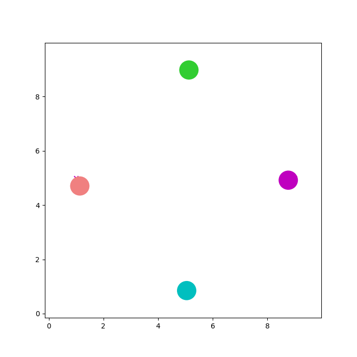

# Introduction

This repository holds the code for my final project for my DRL and Computer Vision classes. I decided to do one project for both classes and I wanted to add a multi-agent collision avoidance twist to it. The project I settled on is using depth maps to learn collision free velocities. A more formal explanation can be found in the project report pdf

# Training
Once all dependencies and gym_miniworld is installed run `python train.py` to begin training the agent. A lot of debugging information will print out as well as the rewards every 5 epochs.

# Visualization
You can visualize any trajectory using the `Visualizer.py` file and passing in a csv playback file as the first argument. You can also view plots and the last trajectory as an image in the `Results.ipynb` file. Below is a visualization of a trajectory that **almost** got it right.

